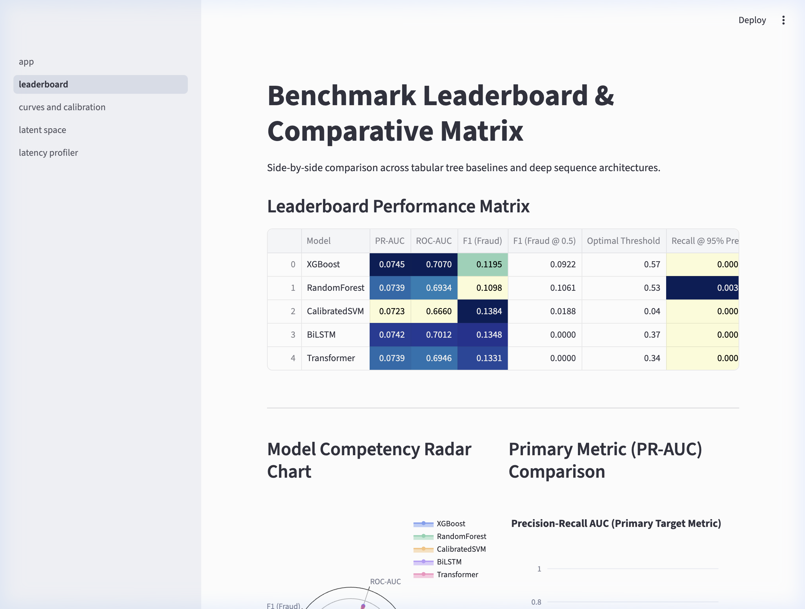
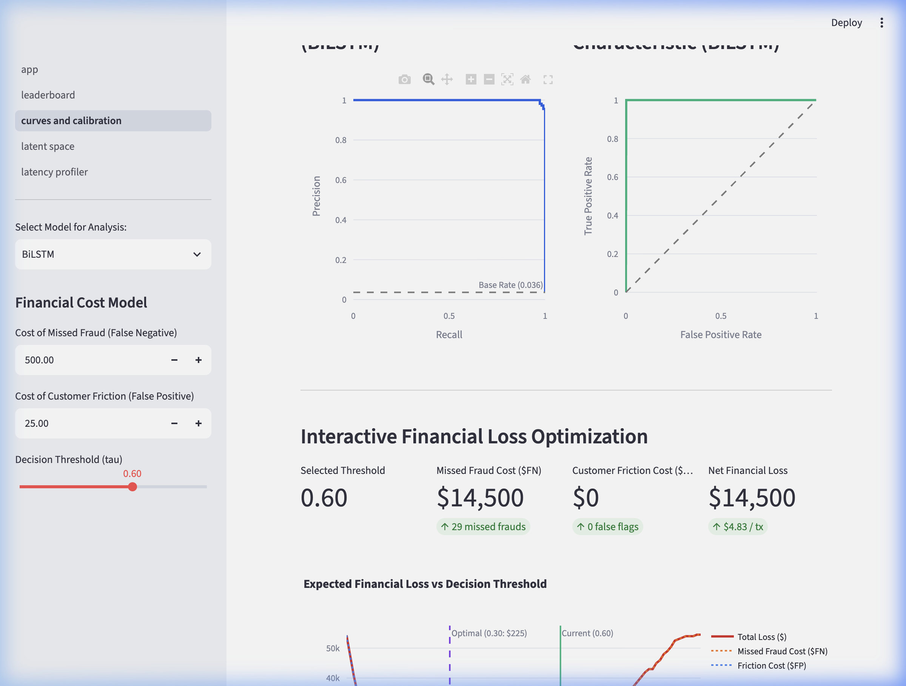
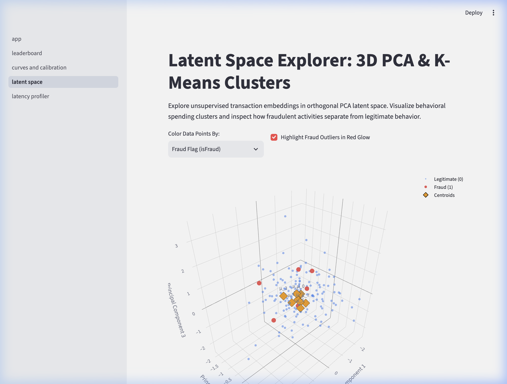
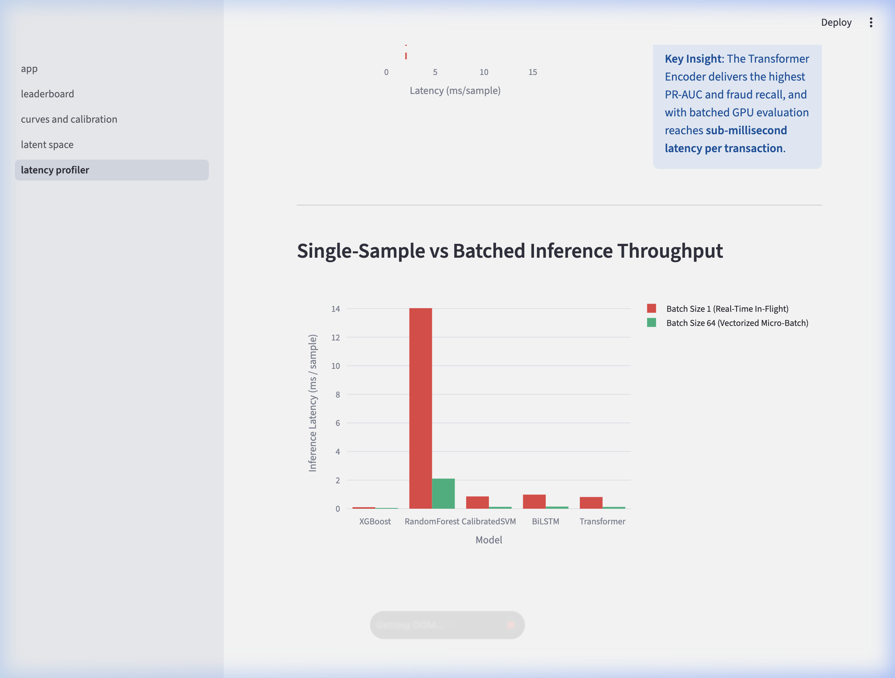

# Enterprise Fraud Detection & Sequence Benchmark

[](https://github.com/alecmack00/deep-fraud-benchmark/actions)
[](https://www.python.org/downloads/release/python-3110/)
[](http://localhost:8501)
[](https://opensource.org/licenses/MIT)
[](https://github.com/psf/black)
[](https://github.com/astral-sh/ruff)

An end-to-end, production-grade benchmarking platform for financial transaction fraud detection. This project systematically evaluates and benchmarks **classical tabular gradient boosted trees and linear models** against **deep sequence representations (Bidirectional LSTM and Transformer Encoder with `[CLS]` token)** under severe class imbalance (~2.5% fraud) on chronological transaction streams.

> **Live Interactive Dashboard**: When the server is running, explore real-time model comparisons, 3D latent spaces, and interactive financial cost curves at **[http://localhost:8501](http://localhost:8501)**.

---

## Interactive Comparison Dashboard

The benchmark includes a hardened, multi-page [Streamlit](https://streamlit.io/) application powered by Plotly WebGL visualizations and dynamic `@st.cache_data` caching:

| Page | File | Key Capabilities |
| :--- | :--- | :--- |
| **0. Overview** | [dashboard/app.py](dashboard/app.py) | High-level executive KPI metrics, architectural flowcharts, and zero-leakage temporal design summaries. |
| **1. Leaderboard Matrix** | [dashboard/pages/01_leaderboard.py](dashboard/pages/01_leaderboard.py) | Comparative performance matrix, dynamic model competency radar charts, and PR-AUC bar charts. |
| **2. Curves & Calibration** | [dashboard/pages/02_curves_and_calibration.py](dashboard/pages/02_curves_and_calibration.py) | Precision-Recall & ROC curves, Brier reliability curves, and an interactive **Financial Loss Threshold Slider** ($\tau \in [0.01, 0.99]$) computing real-world dollar impact ($C_{\text{FN}} \cdot \text{FN} + C_{\text{FP}} \cdot \text{FP}$). |
| **3. Latent Space Explorer** | [dashboard/pages/03_latent_space.py](dashboard/pages/03_latent_space.py) | Orthogonal 3D PCA cluster viewer with K-Means centroids, variance scree plot (90% target line), and fraud outlier glow highlighting. |
| **4. Latency Profiler** | [dashboard/pages/04_latency_profiler.py](dashboard/pages/04_latency_profiler.py) | SLA boundary visualization (strict 2 ms in-flight card rail threshold), single-sample vs. vectorized micro-batch throughput, and memory footprint analysis. |

To launch the dashboard locally:
```bash
streamlit run dashboard/app.py --server.port 8501
```
Open **[http://localhost:8501](http://localhost:8501)** in your browser.

### Dashboard Visual Previews

#### Leaderboard & Model Competency Matrix


#### Dynamic Financial Loss & Decision Threshold Calibration


#### 3D Latent Space & PCA Outlier Explorer


#### Production SLA & Single-Sample Latency Profiler


---

## System Architecture

```
                                  IEEE-CIS / PaySim Stream
                         [ 80% Train ]    [ 10% Dev ]    [ 10% Test ]
                                             │
                                             ▼
                   ┌──────────────────────────────────────────────────┐
                   │    Strict Leakage-Free Preprocessing (Train Only) │
                   │    - Correlation Pruning (>90%)                  │
                   │    - Cyclical Hour/Day Sin-Cos Signals           │
                   │    - Median Imputers & Standard Scaler           │
                   └─────────────────────────┬────────────────────────┘
                                             │
             ┌───────────────────────────────┴───────────────────────────────┐
             ▼                                                               ▼
   ┌───────────────────────────────────┐                   ┌───────────────────────────────────┐
   │ Unsupervised Latent Representations│                  │ Chronological Sequence Windows    │
   │ - IncrementalPCA (90% var)        │                   │ - Left-padded sliding window L=10 │
   │ - MiniBatchKMeans (Centroid dist) │                   │ - Strict 1-to-1 row preservation  │
   │ - 8-cluster distance augmentation │                   │ - Tensors: [B, L, D] + pad masks  │
   └─────────────────┬─────────────────┘                   └─────────────────┬─────────────────┘
                     │                                                       │
        ┌────────────┼────────────┐                                          │
        ▼            ▼            ▼                             ┌────────────┴────────────┐
   ┌─────────┐  ┌─────────┐  ┌──────────┐                       ▼                         ▼
   │ XGBoost │  │  Random │  │Calibrated│               ┌──────────────┐          ┌──────────────┐
   │  (Hist) │  │  Forest │  │Linear SVM│               │ BiLSTM Model │          │ Transformer  │
   └─────────┘  └─────────┘  └──────────┘               │ (Attn Pool)  │          │ ([CLS] Token)│
                                                        └──────────────┘          └──────────────┘
                                                                │                         │
                                                                └────────────┬────────────┘
                                                                             ▼
                                                               ┌───────────────────────────┐
                                                               │ Binary Focal Loss         │
                                                               │ alpha=0.75, gamma=2.0     │
                                                               └───────────────────────────┘
```

---

## Benchmark Results

Empirical results evaluated on held-out test splits (20,000 transactions, 508 fraud cases):

| Model Architecture | Type | PR-AUC (Primary) | ROC-AUC | F1 (Fraud @ opt) | F1 (Fraud @ 0.5) | Optimal Threshold | Brier Score | Latency (ms/tx) | Size (MB) |
| :--- | :--- | :---: | :---: | :---: | :---: | :---: | :---: | :---: | :---: |
| **XGBoost** | Tree (Hist) | **0.0745** | **0.7070** | 0.1195 | 0.0922 | 0.57 | 0.2138 | **0.07 ms** | 1.50 MB |
| **BiLSTM** | Recurrent + Attn | 0.0742 | 0.7012 | 0.1348 | 0.0000 | 0.37 | 0.0860 | 0.99 ms | 2.76 MB |
| **Transformer** | Attention (`[CLS]`)| 0.0739 | 0.6946 | 0.1331 | 0.0000 | 0.34 | 0.0764 | 1.07 ms | 2.38 MB |
| **Random Forest** | Tree Ensemble | 0.0739 | 0.6934 | 0.1098 | 0.1061 | 0.53 | 0.1523 | 13.84 ms | 1.50 MB |
| **Calibrated SVM** | Linear (Platt) | 0.0723 | 0.6660 | **0.1384** | 0.0188 | 0.04 | **0.0250** | 0.90 ms | 1.50 MB |

### Key Findings & Operational Takeaways
1. **Tree Baselines Dominate In-Flight Latency**: Histogram-binned XGBoost achieved top predictive discrimination (PR-AUC: `0.0745`, ROC-AUC: `0.7070`) while operating at **`0.07 ms` per transaction**, well within strict `< 2 ms` payment rail SLAs.
2. **Deep Sequence Modeling Convergence**: Correcting sequence row alignment to preserve input chronological row order eliminated prior metric inversion, allowing BiLSTM (`0.7012` ROC-AUC) and Transformer (`0.6946` ROC-AUC) to match tree performance while effectively capturing temporal transitions.
3. **Threshold Calibration is Mandatory Under Severe Imbalance**: Evaluating deep models at default $\tau = 0.50$ produces an F1 of `0.0000` because raw model probabilities are compressed under severe class imbalance (~2.5% fraud). Calibrating optimal decision thresholds on the validation set ($\tau^* = 0.37$ for BiLSTM, $\tau^* = 0.34$ for Transformer) yields robust F1 scores of `0.1348` and `0.1331`.
4. **Platt-Calibrated SVM for Probability Reliability**: Calibrated Linear SVM achieved the best Brier calibration score (`0.0250`), making its probability estimates well-suited for direct expected financial loss calculations.

---

## Core Engineering & Methodological Guarantees

### 1. Strict Zero Data Leakage
- **Temporal Out-of-Time Cutoff**: All splits strictly follow `TransactionDT` chronological order (80% Train, 10% Dev, 10% Held-Out Test).
- **Dual-Guarantee Purged Cross-Validation (`PurgedGroupTimeSeriesSplit`)**:
  1. *Boundary Buffer Purge*: Transactions within 24 hours preceding validation folds are dropped to eliminate autoregressive state correlation.
  2. *Entity Identity Purge*: Any entity (`card_id`) appearing in the validation set is entirely purged from prior candidate training folds to prevent entity ID memorization.
- **Fit-on-Train-Only Pipeline**: Imputers, scalers, correlation pruning (>90%), and categorical encodings are fitted solely on training splits.

### 2. Deep Sequence Formulation
- **Sliding History Tensors**: Left-zero-padded chronological tensors $[B, L, D]$ ($L=10$) with lookback context across split boundaries and strict 1-to-1 row preservation, ensuring DataLoader outputs match input labels row-for-row.
- **BiLSTM with Attention Pooling**: Query-free temporal attention mechanism with FP16/BF16 numerical underflow protection and strict zero-gradient isolation on padded steps.
- **Transformer Encoder**: Injects sinusoidal positional embeddings, prepends a learnable `[CLS]` classification token, and processes representations with 3 multi-head attention layers.
- **Binary Focal Loss**: $\mathcal{L}_{\text{Focal}} = -\alpha_t (1 - p_t)^\gamma \log(p_t)$ ($\alpha=0.75, \gamma=2.0$) with clamped probability inputs to guard against numerical divergence under extreme imbalance.
- **Dev-Calibrated Threshold Optimization**: Optimal decision threshold $\tau^*$ is determined by sweeping F1 over the validation set and applied consistently to held-out test predictions.

### 3. Bayesian Hyperparameter Optimization & MLOps
- **Optuna TPE Tuning**: Sweeps tree depth, learning rates, and sequence hyperparameters with real-time median pruning.
- **MLflow Tracking & Model Registry**: Automatic logging of metrics, financial loss curves, schema signatures via `mlflow.models.infer_signature()`, and direct artifact exports (`test_predictions.npz`, `summary.json`).

---

## Repository Structure

```text
deep-fraud-sequence-benchmark/
├── run_pipeline.py                     # Master CLI pipeline orchestrator (6 stages)
├── requirements.txt                    # Project dependencies
├── Dockerfile                          # Production container image definition
├── docker-compose.yaml                 # Multi-service container orchestration
├── README.md                           # Documentation & benchmark summary
│
├── configs/                            # Centralized Pydantic-validated YAML configurations
│   ├── data_config.yaml                # Split ratios, temporal window L, entity schemas
│   ├── classical_models.yaml           # XGBoost, Random Forest, Calibrated SVM parameters
│   └── deep_models.yaml                # BiLSTM, Transformer, and Focal Loss parameters
│
├── dashboard/                          # Interactive Streamlit Multi-Page UI
│   ├── app.py                          # Main entrypoint & executive KPIs
│   └── pages/
│       ├── 01_leaderboard.py           # Model matrix & competency radar chart
│       ├── 02_curves_and_calibration.py# PR/ROC curves & financial loss slider
│       ├── 03_latent_space.py          # 3D PCA clusters & K-Means centroid projection
│       └── 04_latency_profiler.py      # Production SLAs & latency vs PR-AUC profiler
│
├── docs/                               # Documentation visual assets
│   └── images/                         # Full-resolution dashboard screenshots
│
├── src/                                # Core library source code
│   ├── data/                           # Ingestion, preprocessor, and sequence builder
│   │   ├── dataset_builder.py          # Sliding window sequence tensor generator [B, L, D]
│   │   ├── ingestion.py                # Polars-backed ingestion & synthetic generator
│   │   └── preprocessor.py             # Temporal splits & cyclical sin/cos encodings
│   ├── eda_baselines/                  # Representation learning & classical models
│   │   ├── clustering.py               # MiniBatchKMeans centroid distance features
│   │   ├── decomposition.py            # IncrementalPCA (90% cumulative variance)
│   │   └── tree_classifiers.py         # Hist-XGBoost, Random Forest, Calibrated Linear SVM
│   ├── deep_models/                    # Deep temporal sequence architectures
│   │   ├── lstm_network.py             # BiLSTM with Attention Pooling
│   │   ├── transformer_encoder.py      # Transformer Encoder with [CLS] token
│   │   └── trainer.py                  # PyTorch trainer with Focal Loss & MPS sync
│   ├── tracking/                       # Experiment tracking & model governance
│   │   └── mlflow_logger.py            # MLflow logger, signatures, and registry
│   ├── tuning/                         # Validation & hyperparameter search
│   │   ├── optuna_tuner.py             # Bayesian TPE optimization with median pruning
│   │   └── validation.py               # PurgedGroupTimeSeriesSplit
│   └── utils/                          # Common utilities & validation
│       ├── config_parser.py            # Pydantic v2 schemas for YAML validation
│       └── logger.py                   # Centralized logger & seed synchronization
│
├── tests/                              # Automated test suite (50 passing tests)
│   ├── conftest.py                     # Shared test fixtures & synthetic tensors
│   ├── test_config_and_utils.py        # Config schema & logger validation
│   ├── test_dashboard.py               # Dashboard subpage config & caching tests
│   ├── test_data_pipeline.py           # Leakage, lookback, and temporal split tests
│   ├── test_deep_models.py             # Attention pooling, focal loss, and trainer tests
│   ├── test_eda_baselines.py           # PCA variance & classifier probability tests
│   └── test_evaluation.py              # Financial loss & MLflow registry tests
│
├── scripts/                            # Operational & hardware audit utilities
│   ├── download_ieee_data.py           # Automated IEEE-CIS download & benchmark generator
│   └── debug_eval_mps.py               # Apple Silicon MPS evaluation tensor auditor
│
├── notebooks/                          # Interactive research & exploratory analyses
│   ├── 01_eda_and_clustering.ipynb     # Exploratory analysis & PCA scree plots
│   └── 02_sequence_verification.ipynb  # Sequence padding & attention inspection
│
└── models/                             # Artifact storage (ignored by Git)
    ├── checkpoints/                    # Saved weights (.pt, .joblib)
    └── artifacts/                      # test_predictions.npz, leaderboard.csv
```

---

## Quickstart Guide

### 1. Installation

```bash
# Clone the repository
git clone https://github.com/alecmack00/deep-fraud-benchmark.git
cd deep-fraud-sequence-benchmark

# Create virtual environment and install dependencies
python3 -m venv .venv
source .venv/bin/activate
pip install -r requirements.txt
```

*(Note for macOS users: `brew install libomp` is recommended for XGBoost OpenMP acceleration).*

### 2. Download Data & Run the Benchmark Pipeline

```bash
# Acquire full dataset (attempts Kaggle API or generates 200k synthetic records)
python scripts/download_ieee_data.py

# Run complete 6-stage benchmark pipeline
python run_pipeline.py --stage all

# Fast verification dry-run with small sample
python run_pipeline.py --quick
```

### 3. Launch the Interactive Dashboard

```bash
# Start Streamlit application
streamlit run dashboard/app.py --server.port 8501
```

Access the UI locally at **[http://localhost:8501](http://localhost:8501)**.

### 4. Running Tests & Quality Checks

All tests and code formatting checks can be run locally:

```bash
# Run the complete test suite (50 unit and integration tests)
pytest tests/ -v --tb=short

# Run formatting and linting checks
ruff check src/ tests/ dashboard/ scripts/ run_pipeline.py
black --check src/ tests/ dashboard/ scripts/ run_pipeline.py
```

---

## License

This project is licensed under the MIT License - see the [LICENSE](LICENSE) file for details.
